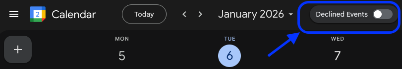

# Google Calendar - Hide Declined Events Extension

A Chrome extension that adds a toggle button to Google Calendar, allowing you to quickly show/hide declined events by automating the native "Show declined events" setting.

## Screenshot



*The "Declined Events" toggle appears next to the date navigation in Google Calendar.*

> 🤖 **Built with AI:** This extension was collaboratively developed with Claude Sonnet 4.5, showcasing the power of AI-assisted development for solving real workflow problems.

## Features

- ✅ **One-click toggle** - Changes Google Calendar's native "Show declined events" setting
- 🎯 **Native integration** - Works with Google's actual setting, not cosmetic hiding
- 🎨 **Seamless design** - Matches Google Calendar's design language
- 🔄 **Auto-sync** - Syncs with manual setting changes
- 💾 **Persistent** - Remembers your preference across sessions and devices
- 🌙 **Dark mode support** - Automatically adapts to your theme
- ♿ **Accessible** - Keyboard navigation and screen reader support

## Installation

### From a Release (Recommended)

1. **Download the latest release ZIP** from the [Releases page](../../releases/latest).
2. **Unzip it** — you'll get a folder containing `manifest.json`, `content.js`, `styles.css`, `icons/`, etc.
3. **Load in Chrome:**
   - Open Chrome and go to `chrome://extensions/`
   - Enable "Developer mode" (toggle in top-right)
   - Click "Load unpacked"
   - Select the unzipped folder

### From Source (Development)

1. **Clone or download this repository.**
2. **Load in Chrome:**
   - Open Chrome and go to `chrome://extensions/`
   - Enable "Developer mode" (toggle in top-right)
   - Click "Load unpacked"
   - Select the repository folder (the one containing `manifest.json`)

### Chrome Web Store (Future)
*Not yet published*

## Usage

1. **Open Google Calendar** at [calendar.google.com](https://calendar.google.com)

2. **Find the toggle button:**
   - Look for "Declined Events" toggle next to the month/year dropdown
   - The toggle reflects the current state of Google Calendar's native setting

3. **Toggle visibility:**
   - Click the toggle to change the setting
   - The extension opens the "Filter and view" menu, clicks the native checkbox, and closes the menu automatically
   - Takes approximately 1 second to complete
   - The setting persists across all your devices via Google's sync
   - Page refreshes automatically to apply the change

4. **Manual changes sync automatically:**
   - If you change the setting manually via Settings → View options → "Show declined events"
   - The toggle will sync when you return to the calendar view

## How It Works

### Version 2.0 - Native Menu Automation

The extension automates Google Calendar's native "Show declined events" setting:

1. **Finds the "Filter and view" menu** (funnel icon in the toolbar)
2. **Opens the menu programmatically** by simulating a click
3. **Locates the "Show declined events" checkbox** in the menu
4. **Clicks the checkbox** if it needs to change state
5. **Closes the menu cleanly** using Escape key and backdrop cleanup
6. **Syncs automatically** when you return from Settings page

### Why Native Menu Automation?

We evaluated multiple approaches:

1. **Google Calendar API** ❌
   - The Calendar API doesn't expose "Show declined events" as a writable setting
   - Would require OAuth and complex authentication

2. **DOM Manipulation (v1.0)** ❌
   - Only cosmetically hides events with CSS
   - Breaks when Google updates their HTML structure
   - Events still load and consume resources

3. **Native Menu Automation (v2.0)** ✅ (Current approach)
   - Uses Google's actual setting system
   - More robust than pure DOM manipulation
   - Setting syncs across devices via Google
   - Proper page refresh applies changes correctly

**Trade-off:** This approach requires ~1 second to open the menu, click the checkbox, and close it. The menu briefly flashes open, but this ensures we're using Google's official setting mechanism.

### Performance

- ✅ Minimal resource usage (only active during toggle operation)
- ✅ ~1 second per toggle operation
- ✅ State syncs via Chrome storage (no polling)
- ✅ Button recreation check only every 5 seconds
- ✅ Auto-sync detects Settings page navigation

## Troubleshooting

### Toggle button doesn't appear

1. **Refresh the page** - The extension might load before Calendar is ready
2. **Check Developer mode** - Make sure the extension is enabled in `chrome://extensions/`
3. **Check console** - Open DevTools (F12) and look for errors

### Toggle takes a moment / brief menu flash

This is normal! The extension needs to:
1. Open the "Filter and view" menu (~200ms)
2. Find and click the checkbox (~300ms)  
3. Close the menu cleanly (~400ms)

The brief menu flash ensures we're using Google's native setting system.

### Toggle doesn't sync with manual changes

If you change the setting in Settings and the toggle doesn't update:
1. Make sure you're returning to the main calendar view (not staying in Settings)
2. The sync happens automatically when the URL changes from `/settings` back to calendar
3. Try refreshing the page if sync doesn't occur

### Extension stopped working after a Google Calendar update

Google may update Calendar's menu structure, breaking the extension temporarily:

1. **Check for extension updates** - Look for a newer version
2. **Report the issue** - [Create a bug report](../../issues/new)
3. **Help fix it** - See [CONTRIBUTING.md](CONTRIBUTING.md) for how to update selectors

**For developers:** The most common breakage points are:
- "Filter and view" button selector
- Menu item structure for "Show declined events" checkbox  
- Date navigation structure for button placement

## Known Limitations

### By Design

- **~1 second operation time** - Opening/closing menus takes time
- **Brief menu flash** - You'll see the "Filter and view" menu briefly
- **Requires menu automation** - Depends on Google's menu structure
- **Chrome only** - Not compatible with Firefox/Edge (different APIs)

### Current Limitations

- **No keyboard shortcut** - Currently only accessible via mouse click
- **Single account** - Extension works with the primary Google account only (u/0)

### Maintenance Notes

⚠️ **This extension automates Google Calendar's menu interactions**, which can break during Google's UI updates:

- Menu selectors may need updating
- Toggle button placement may change
- Menu item structure may be modified

**When this happens:**
1. Check GitHub for updates or open issues
2. If no issue exists, [create one](../../issues/new)
3. **Pull requests welcome!** Fixing selector updates helps everyone

## Browser Support

- ✅ Google Chrome (v88+)
- ✅ Chromium-based browsers (Edge, Brave, etc.)
- ❌ Firefox (requires different extension format)
- ❌ Safari (requires different extension format)

## Privacy

- ✅ No data collection
- ✅ No external network requests
- ✅ Only accesses `calendar.google.com`
- ✅ Settings stored locally in Chrome sync storage
- ✅ Open source - inspect the code yourself

See [PRIVACY.md](PRIVACY.md) for the full privacy policy.

## Development

### File Structure

```
calendar-declined-toggle/
├── manifest.json       # Extension configuration
├── content.js          # Main logic (menu automation, sync)
├── styles.css          # Toggle button styling
├── icons/              # Extension icons (color + monochrome, 16/32/48/128)
│   ├── icon-16.png
│   ├── icon-32.png
│   ├── icon-48.png
│   ├── icon-128.png
│   ├── icon-16-mono.png
│   ├── icon-32-mono.png
│   ├── icon-48-mono.png
│   ├── icon-128-mono.png
│   ├── icon.svg        # Master color SVG (128×128 viewBox)
│   └── icon-mono.svg   # Master monochrome SVG
└── README.md           # This file
```

### Icons

The extension ships with a calendar icon depicting two stacked event rectangles, the bottom one struck through with a diagonal line to signal the declined event being hidden.

- **Color set** — `icons/icon-16.png`, `icon-32.png`, `icon-48.png`, `icon-128.png`. Google Calendar blue (#4285F4) body, white event rectangles outlined in blue, red (#EA4335) diagonal slash on the lower event.
- **Monochrome set** — `icons/icon-16-mono.png` through `icon-128-mono.png`. Same composition in neutral gray (#5F6368) for contexts where the color version clashes.
- **Master SVGs** — `icons/icon.svg` and `icons/icon-mono.svg`. 128×128 viewBox source files. Re-rasterize with any SVG tool (`cairosvg`, `rsvg-convert`, Figma, etc.) if additional sizes are needed.

The color set is referenced in `manifest.json` as the top-level extension icons, which appear in `chrome://extensions/`, the extensions management page, and (when published) the Chrome Web Store listing. The monochrome set and master SVGs ship with the extension as design assets but are not currently referenced by the manifest.

### Making Changes

1. Edit files in your extension folder
2. Go to `chrome://extensions/`
3. Click the refresh icon on your extension
4. Refresh Google Calendar to test

### Debugging

Open Chrome DevTools (F12) while on Google Calendar. The extension logs errors to help with debugging.

### Releasing

Releases are cut with the **Cut Release** workflow, not manual `git tag` commands:

1. Merge whatever changes should ship into `main`
2. Go to the repo's **Actions** tab → **Cut Release** → **Run workflow**
3. Enter a version number (e.g. `2.0.5`, no `v` prefix) and run it

That workflow bumps `manifest.json` and pushes a matching tag, which in turn triggers `release.yml` to build the zip, create the GitHub Release, and publish to the Chrome Web Store — no local git commands needed.

**One-time setup for the Chrome Web Store publish step** (skipped automatically until this is done): the repo needs four secrets under **Settings → Secrets and variables → Actions**:

| Secret | Where it comes from |
|---|---|
| `CHROME_EXTENSION_ID` | The item ID shown in the [Chrome Web Store Developer Dashboard](https://chrome.google.com/webstore/devconsole) for this extension |
| `CHROME_CLIENT_ID` / `CHROME_CLIENT_SECRET` | A Google Cloud project with the **Chrome Web Store API** enabled, and an OAuth client (type: Desktop app) created under **APIs & Services → Credentials** |
| `CHROME_REFRESH_TOKEN` | Obtained once via the [OAuth 2.0 Playground](https://developers.google.com/oauthplayground): use your own client ID/secret (gear icon), authorize scope `https://www.googleapis.com/auth/chromewebstore`, then exchange the auth code for tokens |

The Google Cloud OAuth app can stay in "Testing" mode with just your own account added as a test user — no Google app-verification review needed, since only you ever authorize it.

## Contributing

Found a bug or have an improvement?

See [CONTRIBUTING.md](CONTRIBUTING.md) for detailed guidelines.

Quick links:
- [Report a bug](../../issues/new)
- [Request a feature](../../issues/new)
- [View open issues](../../issues)

## License

MIT License - Feel free to modify and distribute

See [LICENSE](LICENSE) for details.

## Disclaimer

This is an unofficial extension not affiliated with Google. Google Calendar is a trademark of Google LLC.

The extension may stop working if Google updates their Calendar interface. Maintenance and updates depend on community support.

## Version History

See [CHANGELOG.md](CHANGELOG.md).

## Support

Issues? Questions?
- Check the Troubleshooting section above
- Inspect browser console for errors (F12)
- [Open an issue on GitHub](../../issues)

---

**Made with ❤️ for productivity**
